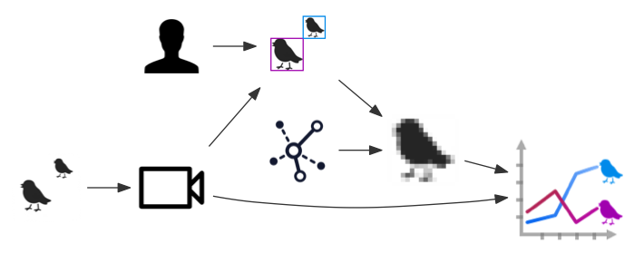

## Goal

The automated real-time recognition of multiple bird species from video recording in the forms of a logical event stream, low- and high-quality images and video clips.




## Design

1. Hardware. Output: photo/video/audio stream
2. Object detection/classification
3. Sharing/reporting

## Run

    make tmpramdrive
    make snapshot
    make webserve

## Hardware

* http://www.wildlifeacoustics.com/products/song-meter-sm4/faqs
* https://mannoiseandanimals.wordpress.com/2016/06/13/recording-stations/
* http://www.feedertweeter.net/about
* https://www.raspberrypi.org/blog/feeder-tweeter/
* http://www.mammalweb.org/
* http://spellfoundry.com/products/sleepy-pi-2/
* https://shop.pimoroni.com/products/mopi-mobile-pi-power
* http://voegeln-live.de/ -- Raspberry Pi Bird House live 1/minute
* http://viilaamo.com/birdhousepages/birdhousemakingof.html  -- wifi, solar-powered rpi + arduino

* http://sonof8bits.com/automated-raspberry-pi-audio-recorder/2014/09 -- record audio using sox, and pause/stop on silence.
* http://baddotrobot.com/blog/2016/01/06/disable-led-for-edimax/
* http://shallowsky.com/blog/hardware/raspberry-pi-noir.html
* https://picamera.readthedocs.io/en/release-1.12/recipes2.html

```sh
echo disable_camera_led=1 >> /boot/config.txt
```
ref: http://shallowsky.com/blog/hardware/raspberry-pi-noir.html

```sh
# echo bcm2708_wdog | sudo tee -a /etc/modules
sudo modprobe bcm2835_wdt
sudo apt-get install -y watchdog
vim /etc/watchdog.conf  # edit 'ping' lines...
...edit /lib/systemd/system/watchdog.service and add line "WantedBy=multi-user.target" under [Install]
...edit sudo vim /etc/default/watchdog and change line to watchdog_module="bcm2835_wdt"
sudo systemctl enable watchdog.service
sudo systemctl start watchdog.service
echo "dtparam=watchdog=on" >> /boot/config.txt
sudo reboot
```
ref: http://blog.ricardoarturocabral.com/2013/01/auto-reboot-hung-raspberry-pi-using-on.html


```sh
rsync -av pi@192.168.1.229:src/biosensor/photos/ photos/
```

```sh
(cd detect/ && python gen_vid_tag_cropped.py)
```

measure cpu/gpu temp:
```sh
cat /sys/class/thermal/thermal_zone0/temp  # cpu
vcgencmd measure_temp  # gpu
```

sunrise/sunset
http://www.risacher.org/sunwait/


## Detection/Classification

### Images/Video

How do we identify stuff?

ref: https://www.quora.com/How-should-I-label-image-data-for-machine-learning
> How should I label image data for machine learning?
> Train a classifier on only some of the frames.
> Then write a program that uses the classifier to display the location of the car in a movie.
> Use that movie to find failure frames and fix the labels for some of those frames.
> Then retrain the classifier. Repeat this a few times and your classifier will be pretty good (if you use a good algorithm).

find files with a given OS X color tag
```sh
mdfind 'kMDItemUserTags == Red'
```

```sh
# concatenate JPEGs into a video
ffmpeg -pattern_type glob -i '2016-10-20-09-*.jpg' -r 30 -c:v libx264 9am.mp4

# https://trac.ffmpeg.org/wiki/Debug/MacroblocksAndMotionVectors
ffmpeg -flags2 +export_mvs -i 9am.mp4 -vf codecview=mv=pf+bf+bb 9am-motionvectors.mp4

# 
ffmpeg -i 9am.mp4 -vf "select=gt(scene\,0.01),setpts=N/(25*TB)" 9am-scenefilter-01.mp4
# helps filter out static shots, but isn't smart enough to deal with light-level changes. motion vectors would be preferred

# chain them both together...
ffmpeg -i 9am.mp4 -vf "select=gt(scene\,0.01),setpts=N/(25*TB)" -f h264 pipe:1 | ffmpeg -y -flags2 +export_mvs -i - -vf codecview=mv=pf+bf+bb 9am-scene-01-motionvectors.mp4

# what i want
ffmpeg -i 9am.mp4 -flags2 +export_mvs -vf "select=gt(mv\,1),setpts=N/(25*TB)" 9am-scene-01-motionvectors.mp4
```

* http://bits.citrusbyte.com/motion-detection-with-raspberry-pi/ -- hooking into H264 motion vectors with picamera
    * https://github.com/citrusbyte/pimotion
    * http://picamera.readthedocs.io/en/release-1.11/recipes2.html#recording-motion-vector-data
        * https://en.wikipedia.org/wiki/Motion_estimation
    * http://picamera.readthedocs.io/en/release-1.11/recipes2.html#splitting-to-from-a-circular-stream
* https://sites.google.com/site/wsgyou/research/livevideo
* http://image-net.org/
* https://github.com/tzutalin/labelImg -- python/QT4 image annotator/labeller w/ multi-file workflow and ImageNet-style customizable multi-label output
* http://coding-robin.de/2013/07/22/train-your-own-opencv-haar-classifier.html
* http://www.pyimagesearch.com/2015/05/25/basic-motion-detection-and-tracking-with-python-and-opencv/
* http://shallowsky.com/blog/linux/install/simplecv-on-rpi.html
* https://github.com/Russell91/TensorBox
* http://www.pyimagesearch.com/2016/06/20/detecting-cats-in-images-with-opencv/
* [OpenCV Tutorial: Training your own detector | packtpub.com](https://www.youtube.com/watch?v=WEzm7L5zoZE)
* https://github.com/samjabrahams/tensorflow-on-raspberry-pi
* https://realpython.com/blog/python/face-detection-in-python-using-a-webcam/
* http://www.bitfusion.io/2016/08/31/training-a-bird-classifier-with-tensorflow-and-tflearn/


### Audio

How does one detect bird calls in an audio file?

1. https://humblesoftwaredev.wordpress.com/2016/05/02/an-audio-dataset-and-ipython-notebook-for-training-a-convolutional-neural-network-to-distinguish-the-sound-of-foosball-goals-from-other-noises-using-tensorflow/
    1. https://github.com/dk1027/ConvolutionalNeuralNetOnFoosballSounds
2. https://www.lunaverus.com/cnn
3. https://www.kaggle.com/c/mlsp-2013-birds
4. http://stackoverflow.com/questions/22471072/convolutional-neural-network-cnn-for-audio


## Sharing/Reporting

...


# References

1. http://www.makeuseof.com/tag/raspberry-pi-camera-module/
2. http://simplecv.org/
3. https://web.wpi.edu/Pubs/E-project/Available/E-project-042910-001603/unrestricted/Bird_Call_Identification_MQP_2010.pdf
4. http://csgrid.org/csg/wildlife/
5. http://www.xeno-canto.org/explore/region
6. https://en.wikipedia.org/wiki/Bioacoustics
7. http://www.pyimagesearch.com/2015/07/20/install-opencv-3-0-and-python-3-4-on-ubuntu/

